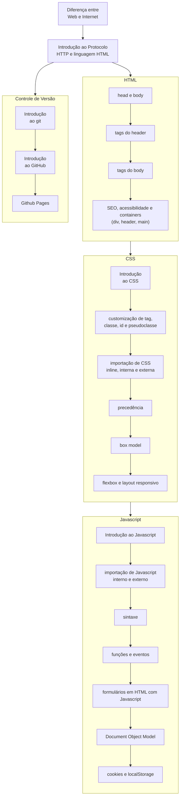

# webEssentials

Esse repositório contém conteúdo relativo a construção de páginas Web com HTML, CSS e Javascript.

O conteúdo se baseia primariamente sobre o [MDN](https://developer.mozilla.org/pt-BR/) e [W3 Schools](https://www.w3schools.com), mas outros materiais 
poderão ser usados.

## Roadmap

O roadmap apresenta uma visão geral dos conceitos que serão aprendidos neste curso.

## Conteúdo original

A seção de conteúdo original possui material elaborado pelo professor Henry Cagnini para essa disciplina. Ele não deve
ser abordado como a totalidade do conhecimento sobre o assunto, mas sim como assuntos pontuais para os quais uma maior
atenção deve ser dada durante o aprendizado.

O conteúdo original pode ser encontrado no diretório [Capítulos](capítulos/README.md).

## Conteúdo externo

Essa seção organiza o conhecimento que será visto na disciplina, a partir de fontes externas. Novamente, não deve ser
considerado a totalidade do material sobre o assunto, mas sim como um fio condutor do que será visto.

* [Fundamentos Web](#fundamentos-web)
* [Design de sites](#design-de-sites)
* [HTTP](#http)
* [HTML](#html)
* [CSS](#css)
* [Javascript](#javascript)
* [Execícios](#exercícios)
* [Outros recursos](#outros-recursos)

### Fundamentos Web

Apostila (disponível junto com o repositório)

* <a href="fundamentos_desenvolvimento_web (pronatec).pdf#page=15">Como tudo começou (pp. 15-20)</a>

### Design de sites

* [Princípios fundamentais de web design](https://desenvolvimentoparaweb.com/ux/4-principios-fundamentais-design/)
* [Heurísticas de Nielsen](https://brasil.uxdesign.cc/10-heur%C3%ADsticas-de-nielsen-para-o-design-de-interface-58d782821840)

### HTTP

* [Visão geral](https://developer.mozilla.org/pt-BR/docs/Web/HTTP/Overview)
* [HTTP, HTML e protocolo REST](https://tableless.com.br/o-grande-desencontro-http-com-o-html/)

### HTML

* [Introdução](https://developer.mozilla.org/pt-BR/docs/Learn/HTML/Introduction_to_HTML/Getting_started)
* [Metadados do cabeçalho](https://developer.mozilla.org/pt-BR/docs/Learn/HTML/Introduction_to_HTML/The_head_metadata_in_HTML)
* [Elementos textuais](https://developer.mozilla.org/pt-BR/docs/Learn/HTML/Introduction_to_HTML/HTML_text_fundamentals)
* [Hyperlinks](https://developer.mozilla.org/pt-BR/docs/Learn/HTML/Introduction_to_HTML/Creating_hyperlinks)
* [Mais sobre elementos textuais](https://developer.mozilla.org/pt-BR/docs/Learn/HTML/Introduction_to_HTML/Advanced_text_formatting)
* [Organizando estruturalmente a página](https://developer.mozilla.org/pt-BR/docs/Learn/HTML/Introduction_to_HTML/Document_and_website_structure)
* [Tabelas em HTML (em inglês)](https://developer.mozilla.org/en-US/docs/Learn/HTML/Tables/Basics)
* [Formulários (em inglês)](https://www.w3schools.com/html/html_forms.asp)
    * [Todos os tipos de formulário (em inglẽs)](https://www.w3schools.com/html/html_form_elements.asp)
    * [Todos os tipos de input (em inglẽs)](https://www.w3schools.com/html/html_form_input_types.asp)

### CSS

* [O que é CSS?](https://developer.mozilla.org/pt-BR/docs/Learn/CSS/First_steps/What_is_CSS)
* [Começando com CSS](https://developer.mozilla.org/pt-BR/docs/Learn/CSS/First_steps/Getting_started)
* [Como o CSS é estruturado](https://developer.mozilla.org/pt-BR/docs/Learn/CSS/First_steps/How_CSS_is_structured)
* [Como o CSS funciona](https://developer.mozilla.org/pt-BR/docs/Learn/CSS/First_steps/How_CSS_works)
* [Estilizando texto (em inglês)](https://developer.mozilla.org/en-US/docs/Learn/CSS/Styling_text/Fundamentals)
* [Estilizando listas](https://developer.mozilla.org/pt-BR/docs/Learn/CSS/Styling_text/Styling_lists)
* [Estilizando links (em inglês)](https://developer.mozilla.org/en-US/docs/Learn/CSS/Styling_text/Styling_links)
* [Fontes da Web (em inglês)](https://developer.mozilla.org/en-US/docs/Learn/CSS/Styling_text/Web_fonts)
* [Cascata e herança](https://developer.mozilla.org/pt-BR/docs/Learn/CSS/Building_blocks/Cascade_and_inheritance)
* [O modelo em caixa (MDN, em inglês)](https://developer.mozilla.org/pt-BR/docs/Learn/CSS/Building_blocks/The_box_model)
* [O modelo em caixa (W3 schools, em inglês)](https://www.w3schools.com/css/css_boxmodel.asp)
* [Seletores em CSS](https://developer.mozilla.org/pt-BR/docs/Learn/CSS/Building_blocks/Selectors)
* [Outros tópicos sobre CSS](https://developer.mozilla.org/pt-BR/docs/Learn/CSS/Building_blocks)

### Javascript

* [O que é Javascript?](https://developer.mozilla.org/pt-BR/docs/Learn/JavaScript/First_steps/What_is_JavaScript)
* [Pensando em Javascript](https://developer.mozilla.org/pt-BR/docs/Learn/JavaScript/First_steps/A_first_splash)
* [O que deu errado? Solução de problemas](https://developer.mozilla.org/pt-BR/docs/Learn/JavaScript/First_steps/What_went_wrong)
* [Variáveis](https://developer.mozilla.org/pt-BR/docs/Learn/JavaScript/First_steps/Variables)
* [Números e operadores](https://developer.mozilla.org/pt-BR/docs/Learn/JavaScript/First_steps/Math)
* [Condicionais: if, else](https://developer.mozilla.org/pt-BR/docs/Learn/JavaScript/Building_blocks/conditionals)
* [Laços de repetição](https://developer.mozilla.org/pt-BR/docs/Learn/JavaScript/Building_blocks/Looping_code)
* **Strings**
  * [Básico](https://developer.mozilla.org/pt-BR/docs/Learn/JavaScript/First_steps/Strings)
  * [Métodos úteis](https://developer.mozilla.org/pt-BR/docs/Learn/JavaScript/First_steps/Useful_string_methods)
* [Arrays](https://developer.mozilla.org/pt-BR/docs/Learn/JavaScript/First_steps/Arrays)
* [Funções](https://developer.mozilla.org/pt-BR/docs/Learn/JavaScript/Building_blocks/Functions)
  * [Construindo uma função](https://developer.mozilla.org/pt-BR/docs/Learn/JavaScript/Building_blocks/Build_your_own_function)
  * [Retorno de valores de uma função](https://developer.mozilla.org/pt-BR/docs/Learn/JavaScript/Building_blocks/Return_values)
* [Objetos](https://developer.mozilla.org/pt-BR/docs/Learn/JavaScript/Objects/Basics)
* [Eventos](https://developer.mozilla.org/pt-BR/docs/Learn/JavaScript/Building_blocks/Events)
  * [Adicionando eventos](https://developer.mozilla.org/pt-BR/docs/Web/API/EventTarget/addEventListener)
* [Document Object Model](https://developer.mozilla.org/pt-BR/docs/Web/API/Document_Object_Model/Introduction)
  * [Selecionando elementos HTML usando DOM](https://developer.mozilla.org/en-US/docs/Web/API/Document_object_model/Locating_DOM_elements_using_selectors)
* [Cookies](https://www.w3schools.com/js/js_cookies.asp) (em inglês)

### Exercícios

* HTML, CSS
    * [Vai dar namoro em HTML](atividades/html_css/reproduzir_markdown.md)
    * [Vai dar namoro em CSS](atividades/html_css/markdown_v2.md)
    * [Reproduzir site do Bing em HTML + CSS](atividades/html_css/reproduzir_bing.md)
    * [Exercício do Box model com Cavaleiros do Zodíaco](atividades/html_css/box_model.md)
* Javascript
  * [Exercícios sobre funções](atividades/javascript/functions/funcoes.md)
  * [Botões](atividades/javascript/functions/botoes.md)
    * [Gabarito](atividades/javascript/functions/botoes.html)
  * [Document Object Model](atividades/javascript/functions/dom.md)
    * [Gabarito](atividades/javascript/functions/gabarito_dom.md)
  * [Desenhando um labirinto com Javascript](atividades/javascript/canvas/labirinto.html)
    * [Animando o Pacman](atividades/javascript/canvas/labirinto_v2.html)
  * [Event Listener](atividades/javascript/functions/event_listener.md)
    * [Gabarito](atividades/javascript/functions/event_listener.html)
  * [Arrays](atividades/javascript/functions/arrays.md)
  * [Strings](atividades/javascript/functions/strings.md)
  * [Cookies](atividades/javascript/cookies/cookies_pt_1.md)
    * [Gabarito](atividades/javascript/cookies/cookies_pt_1.html)

## Outros recursos

Abaixo estão outros recursos que podem lhe auxiliar a aprender desenvolvimento Web. Apesar deste **não ser o conteúdo 
que será cobrado em provas e trabalhos**, ele pode ajudar e muito no seu aprendizado do conteúdo.

* [Hora do Código: Minecraft (em inglês)](https://code.org/minecraft)
* [Fundação Bradesco](https://www.ev.org.br/areas-de-interesse/tecnologia)
* [Grasshopper](https://grasshopper.app/pt_br/)
* [Ferramenta para construção de layouts em HTML](https://www.layoutit.com/build)
