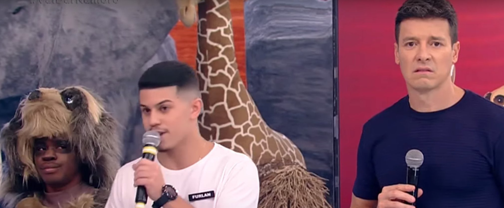

# Vai dar namoro

O objetivo desta atividade é você reproduzir esta página em HTML, **e 
estilizá-la em CSS.**

Crie um novo arquivo **main.html** em algum lugar do seu computador, 
e abra-o com o Sublime Text.

Depois, abra uma tag <html> e comece a montar uma página HTML que seja
_idêntica_ (em relação à estrutura) à página atual. 

Crie também um arquivo **main.css**, e linke-o ao HTML. No arquivo CSS você
vai definir o estilo da página (fontes, cores, tamanhos, etc).

Não deixe passar nada: copie a fonte, os parágrafos, as ênfases (**negrito**
e _itálico_), as imagens, as tabelas, tudo!

## CSS

A estilização em CSS é por sua conta: você pode usar os recursos que achar 
melhor. Como sugestão, comece pela lista abaixo:

1. Uma fonte para o texto dos parágrafos (`
`)
2. Uma fonte para o texto dos headers (`<h1>, <h2>`, etc)
3. Use uma fonte do [Google Fonts](https://fonts.google.com/)
4. Coloque uma cor no background
5. Faça com que os links (`<a>`) sejam sublinhados quando passamos o mouse pro 
   cima deles
6. Faça com que os títulos fiquem centralizados na página

## Cantadas 

* Você não é pescoço mais mexeu com a minha cabeça! 
* Você é o ovo que faltava na minha marmita.
* Me chama de tabela periódica e diz que rola uma química entre nós.
* Você é tão desejada quanto uma sexta-feira!
* Em cima da colina passa boi passa boiada, só saio da sua frente quando for 
  minha namorada.
* Gata, você é o doce de leite Que falta no meu churros.
* Meu nome e Arnaldo mais pode me chamar de Naldo, pois quando eu te vi perdi o 
  ar.
* Me chama de previsão do tempo e diz que tá rolando um clima.

## Quiz

[Qual cantada do Vai Dar Namoro mais combina com você? ](
https://recordtv.r7.com/hora-do-faro/qual-cantada-do-vai-dar-namoro-mais-combina-com-voce-23052022)

## Efeitos sonoros

| Nome                  | Áudio                                                                                 |
|:----------------------|:--------------------------------------------------------------------------------------|
| UUUUiiii              | [link](https://www.myinstants.com/en/instant/ui-rodrigo-faro-92457/)                  |
| Ele gosta             | [link](https://www.myinstants.com/en/instant/ele-gosta-1026/)                         |
| Tome                  | [link](https://www.myinstants.com/pt/instant/tome-rodrigo-faro-31061/)                |
| Dança gatinho, dança! | [link](https://www.myinstants.com/pt/instant/danca-gatinho-danca-rodrigo-faro-41651/) |