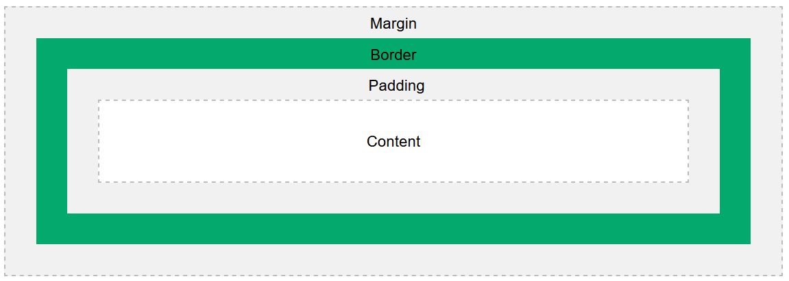

# Box Model

Em CSS, o box model é um conceito fundamental que descreve a estrutura de um elemento HTML como uma caixa retangular.
Cada elemento é composto por quatro áreas principais: conteúdo, preenchimento (padding), borda (border) e margem (
margin).



É possível manipular esses atributos em CSS:

```css
div {
  width: 300px;
  border: 15px solid green;
  padding: 50px;
  margin: 20px;
}
```