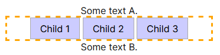
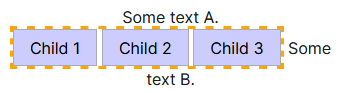
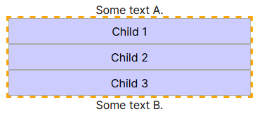
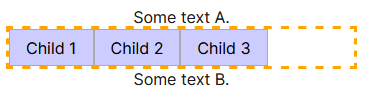

# Display Types

A propriedade `display` muda a maneira como os itens serão mostrados. Os possíveis valores são descritos abaixo.

Para ver uma visualização prática dos diferentes tipos, use o demo do site 
MDN: https://developer.mozilla.org/en-US/docs/Web/CSS/Reference/Properties/display

## Block

Elementos com `display: block` ocupam toda a largura disponível, ou seja, eles se estendem de um lado ao outro do
contêiner pai. Eles começam em uma nova linha e empurram o conteúdo seguinte para baixo. 

## Inline

Elementos com `display: inline` ocupam apenas a largura necessária para seu conteúdo e não começam em uma nova linha.
Eles permitem que outros elementos fiquem ao seu lado, ou seja, eles fluem dentro do texto. 

## Grid

Elementos com `display: grid` se tornam contêineres de grade, permitindo que seus filhos sejam organizados em linhas e
colunas. O grid oferece controle sobre o layout bidimensional, permitindo que os itens sejam posicionados em áreas
específicas da grade, com controle sobre o alinhamento, espaçamento e dimensionamento dos itens.

## None

Elementos com `display: none` não são exibidos na página e não ocupam espaço algum. Eles são completamente removidos do
layout, ou seja, eles não afetam a posição ou o comportamento dos outros elementos na página.

## Flex

Elementos com `display: flex` se tornam contêineres flexíveis, permitindo que seus filhos sejam dispostos de
maneira flexível, seja em linha (horizontal) ou em coluna (vertical). O flexbox oferece controle sobre direção, 
alinhamento, espaçamento e ordem dos itens dentro do contêiner flexível.

Consulte o seguinte link para uma explicação detalhada do flexbox: https://css-tricks.com/snippets/css/a-guide-to-flexbox/